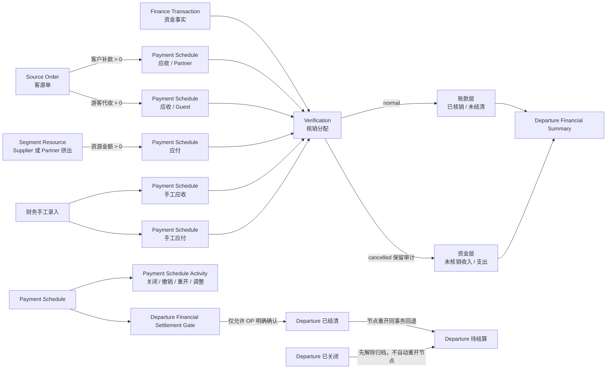

# 小团宝财务闭环可靠性审计

> 状态：进行中  
> 审计基线：`71fc894985cd80bf079e4403e34c58d409288d8e`（`main`）  
> 首次记录：2026-07-10，Asia/Taipei  
> 用户原有未提交文件：`apps/api/scripts/seed-xbzt-test-org.cjs`（仅在定位测试数据来源时读取，未修改、未纳入审计改动）

## 1. 判定口径

- 业务语义来源：`CONTEXT.md` 与已接受 ADR。
- 实现事实来源：当前 Prisma schema、后端 public HTTP 接口及服务、Departure read model、前端入口和自动化测试。
- 文档与代码冲突时不替任一方做业务裁决；本报告单列冲突。
- 缺陷必须有可重复红灯、最小复现、可证伪假设和根因证据。
- 测试 seam 已由目标确认：shared 纯领域、Finance Facade/Service、public HTTP E2E、必要的浏览器 E2E。

## 2. 财务对象、状态与资金流关系图



## 3. 财务业务地图

| 对象 | 事实来源 | 创建/改变者与前置条件 | 状态与金额影响 | 可逆操作与审计 | 跨模块读模型 | 失败时必须保持 |
|---|---|---|---|---|---|---|
| Source Order | Partner、成人/儿童人数与单价、优惠、收款拆分 | 计调创建/编辑；发团关闭时拒绝；财务介入后金额字段锁定 | `gross = 成人×单价 + 儿童×单价`；`net = gross - discount`；拆为客户补款与游客代收 | 已介入后仅能经节点“调整约定金额”同步路径金额并留痕 | 客源状态、发团收入与毛利、应收生成状态 | 源事实与已有节点不得部分同步 |
| Itinerary Segment | 发团日期与目的地规划 | 计调维护；关闭发团只读 | 本身不生成财务事实，是 Segment Resource 的成本锚点 | 无直接财务纠错 | 发团执行安排与成本汇总 | 段与资源关系不被部分破坏 |
| Segment Resource | Resource Kind、Supplier/Partner、约定金额 | 计调创建/编辑并显式生成应付；金额须大于 0；已介入后锁定 | 每条资源对应一次性应付来源；拼出对手方为 Partner，其余为 Supplier | 已介入后经节点调整同步原资源金额并留痕 | 资源应付状态、发团成本与毛利 | 资源金额与节点金额不得分叉 |
| Payment Schedule | 手工录入，或 Source Order / Segment Resource 显式生成 | 财务可手工创建；计调/财务可触发源生成；已关闭发团拒绝 | `pending/overdue/settled/cancelled`；部分核销不单独存状态；关闭不清零未结清 | 关闭、重开、调整；核销撤销；Activity 保留快照 | 全局 AR/AP、发团财务 Tab、源应收/应付状态、结算门槛 | 节点、来源、活动、发团联动全成或全败 |
| Finance Transaction | 财务手工新增，或登记收/付款时创建 | 财务；金额 > 0、通道必填；可不关联发团 | `inflow/outflow`；核销状态由有效 Verification 派生；作废后不可再核销 | 未核销可编辑；未核销可作废且原因必填；资金退回须另建反向记录 | 流水列表/详情、发团未核销资金摘要 | 登记并核销不得留下孤立半成品流水 |
| Verification | Payment Schedule 与 Finance Transaction 的金额分配 | 财务；方向、对手方、Organization 一致；两侧余额足够；发团未关闭 | `normal/cancelled`；只有 normal 影响两侧金额 | 撤销保留原记录、操作者、原因、时间；流水资金恢复未核销 | 节点结清、流水核销、发团账款/资金双层摘要 | 并发下两侧都不得超额；失败不得创建记录或消耗编号对应业务事实 |
| Payment Schedule Activity | 节点关闭、关闭后撤销、重开、明确调额 | 财务动作随主事务写入 | 保存前后金额与原因，不直接成为结清权威 | 只追加，不删除原履历 | 节点详情时间线 | 主动作与 Activity 同成败 |
| Departure Financial Summary | Source Order、Segment Resource、Schedule、Verification、Transaction 聚合 | 只读派生 | 账款层与资金层分离；关闭节点未结清不计开放待收/待付 | 随有效核销撤销而重新派生 | 发团列表/详情 | 不得隐藏未核销资金或把关闭节点未结清清零 |

### 3.1 关键状态迁移

| 对象 | 允许迁移 | 拒绝路径 | 原子联动 |
|---|---|---|---|
| Payment Schedule | 开放 → 部分核销 → 已结清；开放未结清 → 已关闭；已关闭 → 重新打开 | 已结清不可关闭；已关闭不可核销/普通编辑/调额；有有效核销不可调额 | 已结清发团下重开节点时，节点与发团一同回退待结算 |
| Verification | normal → cancelled | 重复撤销、关闭发团期间撤销 | 撤销与关闭节点 Activity（如适用）同事务 |
| Finance Transaction | 正常未核销 → 编辑；正常未核销 → 作废 | 有有效核销不可编辑/作废；已作废不可恢复 | 登记收/付款时，流水创建与核销同事务 |
| Departure | 编辑中 → 待结算 → 已结清 → 已关闭；已关闭 → 待结算 | 账款结束门槛为假不可已结清；关闭期间所有财务变更拒绝 | 重开节点回退、归档/解除归档均需留痕；解除归档不重开节点 |

## 4. 独立财务不变量目录

| ID | 独立判定 | 当前主要 seam | 当前状态 |
|---|---|---|---|
| I1 | 节点有效核销 ≤ 约定金额；未结清 = 约定 - 有效核销 | HTTP E2E + integrity check | 已新增并发红灯与修复；完整性命令待建 |
| I2 | 流水有效核销 ≤ 流水金额；未核销 = 流水 - 有效核销 | HTTP E2E + integrity check | 已新增并发红灯与修复；完整性命令待建 |
| I3 | 核销两侧方向、往来对象、Organization 一致；撤销仅失效不删除 | shared + HTTP E2E | 方向/对象/组织现有覆盖；跨组织矩阵待扩 |
| I4 | 同一来源一次性生成；关闭后仍视为已生成 | Facade/Service + HTTP E2E + 唯一性检查 | 串行路径有覆盖；并发生成待验证 |
| I5 | 撤销最后核销不清除 finance history；已介入调额显式留痕 | Facade/Service + HTTP journey | 已有正向/拒绝路径；源金额语义冲突待裁决 |
| I6 | 已结清发团无开放节点；重开与回退原子；门槛不自动结清 | HTTP journey + integrity check | 现有 journey 覆盖；并发回退待验证 |
| I7 | 已关闭发团财务只读；解除归档不重开节点 | HTTP journey + browser | 主要路径现有覆盖；无 departureId 流水历史关联待验证 |
| I8 | 撤销后账款恢复、原流水成为未核销资金，两层不抵消 | shared + HTTP journey | 现有 journey 覆盖；摘要 mutation 待证明 |
| I9 | 所有读写受 organizationId 与后端权限约束 | HTTP E2E + integrity check | 基础覆盖存在；跨组织实体组合与停用 Employee 待扩 |
| I10 | 多表动作原子且幂等；异常/并发不产生重复或超额事实 | HTTP 并发/故障注入 + DB 约束 | 已确认并修复并发超额核销；其余动作待验证 |

## 5. 场景—不变量—测试 seam 覆盖矩阵（当前）

| 高危场景 | 不变量 | seam | 现有证据 | 缺口 |
|---|---|---|---|---|
| 两名财务同时核销同一节点/流水 | I1/I2/I10 | public HTTP E2E | `finance.e2e-spec.ts` 并发 8 请求 | 已补齐，连续 3 次通过 |
| 同一来源并发生成 | I4/I10 | generation HTTP E2E | 仅串行拒绝重复 | 并发红灯待建 |
| 登记成功、核销失败 | I10 | HTTP E2E + 故障注入 | 代码使用事务；普通 journey 通过 | 取消事务 mutation 待做 |
| 撤销后关闭/重开/再核销 | I5/I6/I8 | HTTP journey | `finance-journey.e2e-spec.ts` 已覆盖主体 | 并发撤销/重开待扩 |
| 已结清发团重开中途失败 | I6/I10 | HTTP E2E + 故障注入 | 主事务存在 | Activity/状态失败注入待做 |
| 已关闭发团直接 API 绕过 UI | I7/I9 | HTTP E2E | 主要 Finance/Departure 写路径有覆盖 | 历史关联但无 departureId 的流水待验证 |
| 跨 Organization 已知 ID | I3/I9 | HTTP E2E + integrity check | 节点基础隔离有覆盖 | 组合伪造、读取详情、活动/源引用待扩 |
| 源金额变化后摘要分叉 | I5/I8 | Facade + HTTP journey | finance-touched mismatch 已覆盖 | Gross Receivable 语义冲突待裁决 |
| 节点关闭后未结清归零 | I1/I6 | shared + HTTP journey | read model 排除开放汇总但节点保留余额 | mutation 待证明 |
| 撤销后原流水从摘要消失 | I8 | shared + HTTP journey | 未核销资金正向覆盖 | mutation 待证明 |

## 6. 已确认缺陷

### F-001（P0）并发核销可同时穿透余额校验，产生超额核销与负未核销金额

- 影响用户：财务、企业管理员，以及依赖发团财务摘要的计调。
- 违反不变量：I1、I2、I10。
- 最小复现：同一 100.00 元应收节点与同一 100.00 元收入流水，同时提交两个 100.00 元核销请求；最小场景约 1/3 复现。8 并发为确定性红灯。
- 红灯命令：

  ```bash
  cd apps/api
  pnpm exec dotenv -e ../../.env -- jest --config jest-e2e.config.js --runInBand test/finance.e2e-spec.ts -t 'never over-allocates'
  ```

- 红灯证据：故障时 3–8 个请求可同时返回 201；已观察 `settledAmountCents=50000`、`allocatedAmountCents=50000`、`unallocatedAmountCents=-40000`，而节点和流水各只有 10000。
- 根因：`VerificationService.create` 原实现分别聚合余额、校验后再插入；无包围整个动作的事务，也没有锁住同一 Schedule/Transaction。并发探针证明多个请求在插入前同时观察到两侧余额为 0。业务编号分配位于余额校验之后，只生成不同核销号，不能防止超额。
- 修复：无外部事务时由 `VerificationService.create` 自建事务；所有入口在校验前按固定顺序对 `payment_schedules`、`finance_transactions` 目标行执行 `FOR UPDATE`，再读取并插入。
- mutation 证明：临时移除行锁调用后，同一测试红灯，观察 3 个成功请求与 `unallocatedAmountCents=-20000`；随后恢复行锁。
- 绿灯：目标测试连续三次一致通过；完整 `finance.e2e-spec.ts` 69/69 通过；API typecheck 通过。

### F-002（P0）同一业务来源并发生成会创建重复应收/应付节点

- 影响用户：计调、财务、企业管理员。
- 违反不变量：I4、I10。
- 红灯：8 个并发“生成应收”请求全部在同一客源单上执行；观察 8 次成功、16 条节点（正确值为 1 次成功、客户补款/游客代收各 1 条）。
- 根因：一次性生成判断与逐路径创建不在同一事务；所有请求同时看到来源节点数为 0。schema 原先只保证业务编号唯一，没有来源唯一约束。
- 修复：生成应收时锁定 Source Order，在同一事务内重读、判断并创建全部路径；生成应付对称锁定 Segment Resource；`PaymentScheduleService.create` 支持复用调用方事务；schema 增加 `(organizationId, direction, sourceType, sourceId)` 唯一约束与迁移。
- mutation 证明：临时移除 Source Order 行锁后，8 个请求再次全部成功并创建 16 条节点；恢复后目标测试连续三次通过。
- 绿灯：`source-order-receivables.e2e-spec.ts` 13/13、`segment-resource-payables.e2e-spec.ts` 10/10。

### F-003（P1）并发生成应付以 500 暴露唯一约束冲突

- 影响用户：计调在重复点击、超时重试时看到系统错误，无法判断是否已生成成功。
- 违反不变量：I4、I10 的确定性重试语义。
- 红灯：增加来源唯一约束后，8 个并发请求得到 1 个 201、3 个 409、4 个 500；数据库只有 1 条节点，但 API 行为不稳定。
- 根因：Segment Resource 的“已生成”检查仍在锁外，竞争失败依赖 Prisma P2002 泄漏为 500。
- 修复：锁定 Segment Resource 并在同一事务内检查与创建；现在稳定为 1 个 201、7 个 409。

### F-004（P1）并发重复撤销同一核销会重复成功并污染审计时间线

- 影响用户：财务、审计人员、计调。
- 违反不变量：I5、I10。
- 红灯：8 个并发撤销请求中 4 个返回 201，并为同一 Verification 写出 4 条 `verification_cancelled` Activity；无行锁 mutation 时 8/8 成功并写 8 条活动。
- 根因：核销状态在事务外读取；更新只按 ID，多个请求同时看到 `normal` 后各自更新并追加 Activity。
- 修复：事务内锁定 Verification，重读状态后完成撤销与 Activity；重复请求稳定拒绝。

### F-005（P0）流水编辑/作废与核销并发可制造负余额或“已作废且已核销”

- 影响用户：财务、企业管理员及发团摘要消费者。
- 违反不变量：I2、I3、I10。
- 红灯 A：核销 500.00 元同时把流水金额改为 100.00 元，最终 `allocated=50000`、`unallocated=-40000`。
- 红灯 B：核销与作废并发，最终同一流水 `voidedAt != null` 且 `allocated=50000`，9 个竞争写请求返回成功。
- 根因：编辑/作废在事务外读取核销额，检查后才 UPDATE；没有与核销创建共用流水行锁。
- 修复：编辑、作废都在事务内先锁 Finance Transaction，再重读状态与有效核销额后更新；与核销创建使用同一行锁临界区。
- mutation 证明：分别移除编辑锁、作废锁后，两条红灯稳定恢复；复原后均通过。

### F-006（P1）无显式 departureId 的历史核销流水可绕过归档写保护

- 影响用户：OP、财务、审计人员。
- 违反不变量：I7、I10。
- 最小复现：创建未填写 `departureId` 的流水 → 核销至发团节点 → 撤销核销 → 关闭发团 → 直接 API 作废流水；原实现返回 201。
- 根因：流水编辑/作废只检查 `FinanceTransaction.departureId`，忽略保留在已撤销 Verification 中的发团历史关联。
- 修复：流水写保护集合改为“当前/目标显式关联发团 + 全部核销历史关联发团”；集合内任一发团关闭即拒绝编辑/作废。

### F-007（P0）Finance E2E 清理会删除整个 Organization 的既有流水与核销

- 影响用户：共享测试/验收环境中的所有财务数据；也会让后续测试基于被破坏的假状态继续运行。
- 违反不变量：I1、I2、I6、I8、I9、I10，以及验收结果可重复性。
- 红灯：运行完整 `finance.e2e-spec.ts` 后，`pnpm finance:integrity-check` 报告已结清发团 `XTB2026070001` 的 3 个节点全部重新开放；只读查询证明原 Verification 与 Finance Transaction 已消失。
- 根因：suite `afterAll` 使用 `deleteMany({ organizationId })` 清除全部 Verification 和 Transaction，而 Schedule 只清理测试发团，直接破坏该 Organization 的预置闭环数据。
- 修复：清理前按本 suite 的 departure、counterparty 与 test prefix 精确收集 transaction IDs；只删除这些流水及其核销。`afterAll` 新建不属于 fixture 范围的哨兵流水/核销，清理后断言二者仍存在，再自行删除哨兵。
- 当前环境：被旧清理逻辑删除的演示资金事实尚未自动重建；完整性检查会继续以非零退出并报告 3 条 P1，避免把受损环境误判为绿灯。重灌演示业务数据是破坏性动作，未擅自执行。

### F-008（P1）停用 Employee 的既有 JWT 仍可访问财务 API

- 影响用户：Organization 管理员、所有财务数据主体。
- 违反不变量：I9。
- 红灯：财务 Employee 登录取得 token 后被设为 disabled，旧 token 调 `/finance/transactions` 仍返回 200。
- 根因：`JwtStrategy.validate` 只验 JWT 签名与 payload；仅登录和 `/auth/me` 检查 Employee 状态，业务 API 不经过状态检查。
- 修复：每次 JWT 校验重新读取 User 与 Organization，要求 User 属于 token Organization、enabled、未删除且 Organization 未删除；权限与 Platform Admin 状态取当前数据库事实。

## 7. 文档—代码冲突与未裁决风险

这些项目尚不能直接记为缺陷：

1. **Finance Facade 边界未按 ADR-0004 落地**：ADR 要求 Facade 拥有 generation、snapshot、source finance state；当前 `DepartureFinanceFacade` 主要承担归档写门槛、结清回退与调额同步，生成和 source state 仍在 `DepartureFinanceBridgeService`，`DepartureReadModelService` 仍直接读取 Payment Schedule/Verification。属于架构债与测试 seam 漂移，尚未证明造成错误财务事实。
2. **业务时区命名冲突**：ADR-0003 与代码明确使用 Asia/Shanghai；本目标要求覆盖 Asia/Taipei 边界。两者当前 UTC 偏移相同且均无 DST，数值结果一致，但权威命名未统一。
3. **客源应收显式调额与 Gross Receivable 定义冲突**：`CONTEXT.md` 定义 Gross Receivable 必须由成人/儿童数量与单价派生；当前显式调整单一路径时不改人数/单价，却把 `grossReceivableCents` 改为“调整后两路径之和 + 优惠”。现有 journey 把这种行为写成预期。需业务裁决：调额是在改客源计价事实，还是只建立财务调整差异；裁决前不擅自修改。

## 8. 基线验证

- `pnpm typecheck`：通过。
- `pnpm --filter @xiaotuanbao/shared test`：12 suites / 45 tests 通过。
- 首次全量 `finance.e2e-spec.ts`：67 通过、1 次 `ECONNRESET`；单测重跑时错误漂移到其他用例，初步归类为 E2E 稳定性风险，不当作业务缺陷。
- 当前完整 `finance.e2e-spec.ts`：72/72 通过（F-006 加入后目标用例单独通过，下一轮全量会更新总数）。
- `finance-integrity-check.integration-spec.ts`：通过故障注入识别节点/流水超额与负余额，并输出业务编号。
- `pnpm finance:integrity-check`：当前正确返回 1；发现 3 条由 F-007 造成的已结清发团开放节点。
- shared fixed-seed property：2,000×2 轮通过；临时把“到期日早于业务日”改为“早于等于”后测试稳定变红，随后恢复。

## 9. 待完成

- 并发生成、重复提交、并发撤销、并发编辑/作废与归档竞争的红灯诊断。
- public HTTP 跨 Organization、角色与停用 Employee 完整矩阵。
- shared 固定 seed property/fuzz。
- 浏览器确认语义、权限入口、缓存刷新与跨页联动。
- 只读 `finance-integrity-check` 命令及异常数据 mutation。
- 全量 typecheck/unit/API E2E/关键 journey/integrity check 连续三次。
- P0/P1/P2 修复任务草案、依赖图与最终发布门槛。
