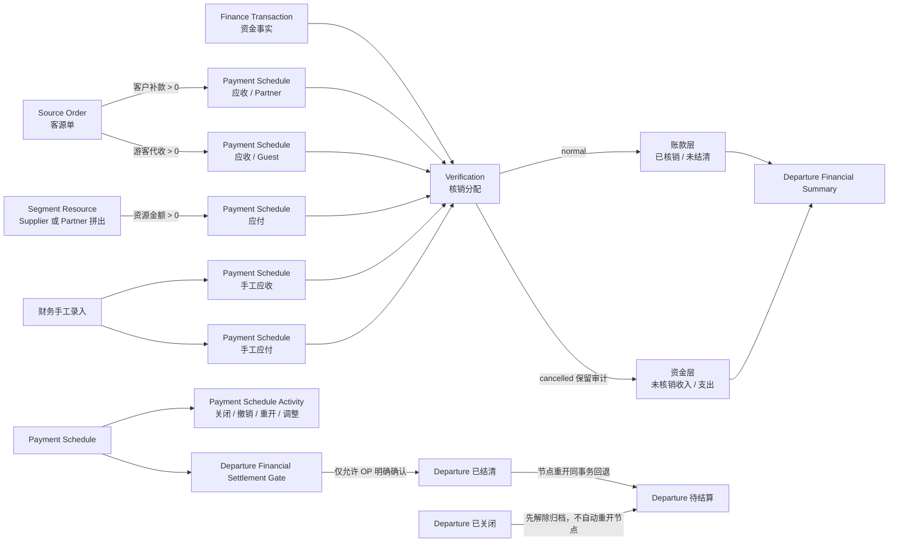

# 小团宝财务闭环可靠性审计

> 状态：审计与高危并发修复已完成；发布门槛尚未通过
> 审计基线：`71fc894985cd80bf079e4403e34c58d409288d8e`（`main`）  
> 当前复核：`deaff4a`（`main`，另有本轮未提交的并发修复与测试）
> 首次记录：2026-07-10，Asia/Taipei  
> 启动时用户原有未提交文件：`apps/api/scripts/seed-xbzt-test-org.cjs`（本轮未修改、未纳入审计改动）

## 1. 判定口径

- 业务语义来源：`CONTEXT.md` 与已接受 ADR。
- 实现事实来源：当前 Prisma schema、后端 public HTTP 接口及服务、Departure read model、前端入口和自动化测试。
- 文档与代码冲突时不替任一方做业务裁决；本报告单列冲突。
- 缺陷必须有可重复红灯、最小复现、可证伪假设和根因证据。
- 测试 seam 已由目标确认：shared 纯领域、Finance Facade/Service、public HTTP E2E、必要的浏览器 E2E。

## 2. 财务对象、状态与资金流关系图



## 3. 财务业务地图

| 对象 | 事实来源 | 创建/改变者与前置条件 | 状态与金额影响 | 可逆操作与审计 | 跨模块读模型 | 失败时必须保持 |
|---|---|---|---|---|---|---|
| Source Order | Partner、成人/儿童人数与单价、优惠、收款拆分 | 计调创建/编辑；发团关闭时拒绝；财务介入后金额字段锁定 | `gross = 成人×单价 + 儿童×单价`；`net = gross - discount`；拆为客户补款与游客代收 | 已介入后仅能经节点“调整约定金额”同步路径金额并留痕 | 客源状态、发团收入与毛利、应收生成状态 | 源事实与已有节点不得部分同步 |
| Itinerary Segment | 发团日期与目的地规划 | 计调维护；关闭发团只读 | 本身不生成财务事实，是 Segment Resource 的成本锚点 | 无直接财务纠错 | 发团执行安排与成本汇总 | 段与资源关系不被部分破坏 |
| Segment Resource | Resource Kind、Supplier/Partner、约定金额 | 计调创建/编辑并显式生成应付；金额须大于 0；已介入后锁定 | 每条资源对应一次性应付来源；拼出对手方为 Partner，其余为 Supplier | 已介入后经节点调整同步原资源金额并留痕 | 资源应付状态、发团成本与毛利 | 资源金额与节点金额不得分叉 |
| Payment Schedule | 手工录入，或 Source Order / Segment Resource 显式生成 | 财务可手工创建；计调/财务可触发源生成；已关闭发团拒绝 | `pending/overdue/settled/cancelled`；部分核销不单独存状态；关闭不清零未结清 | 关闭、重开、调整；核销撤销；Activity 保留快照 | 全局 AR/AP、发团财务 Tab、源应收/应付状态、结算门槛 | 节点、来源、活动、发团联动全成或全败 |
| Finance Transaction | 财务手工新增，或登记收/付款时创建 | 财务；金额 > 0、通道必填；可不关联发团 | `inflow/outflow`；核销状态由有效 Verification 派生；作废后不可再核销 | 未核销可编辑；未核销可作废且原因必填；资金退回须另建反向记录 | 流水列表/详情、发团未核销资金摘要 | 登记并核销不得留下孤立半成品流水 |
| Verification | Payment Schedule 与 Finance Transaction 的金额分配 | 财务；方向、对手方、Organization 一致；两侧余额足够；发团未关闭 | `normal/cancelled`；只有 normal 影响两侧金额 | 撤销保留原记录、操作者、原因、时间；流水资金恢复未核销 | 节点结清、流水核销、发团账款/资金双层摘要 | 并发下两侧都不得超额；失败不得创建记录或消耗编号对应业务事实 |
| Payment Schedule Activity | 节点关闭、关闭后撤销、重开、明确调额 | 财务动作随主事务写入 | 保存前后金额与原因，不直接成为结清权威 | 只追加，不删除原履历 | 节点详情时间线 | 主动作与 Activity 同成败 |
| Departure Financial Summary | Source Order、Segment Resource、Schedule、Verification、Transaction 聚合 | 只读派生 | 账款层与资金层分离；关闭节点未结清不计开放待收/待付 | 随有效核销撤销而重新派生 | 发团列表/详情 | 不得隐藏未核销资金或把关闭节点未结清清零 |

### 3.1 关键状态迁移

| 对象 | 允许迁移 | 拒绝路径 | 原子联动 |
|---|---|---|---|
| Payment Schedule | 开放 → 部分核销 → 已结清；开放未结清 → 已关闭；已关闭 → 重新打开 | 已结清不可关闭；已关闭不可核销/普通编辑/调额；有有效核销不可调额 | 已结清发团下重开节点时，节点与发团一同回退待结算 |
| Verification | normal → cancelled | 重复撤销、关闭发团期间撤销 | 撤销与关闭节点 Activity（如适用）同事务 |
| Finance Transaction | 正常未核销 → 编辑；正常未核销 → 作废 | 有有效核销不可编辑/作废；已作废不可恢复 | 登记收/付款时，流水创建与核销同事务 |
| Departure | 编辑中 → 待结算 → 已结清 → 已关闭；已关闭 → 待结算 | 账款结束门槛为假不可已结清；关闭期间所有财务变更拒绝 | 重开节点回退、归档/解除归档均需留痕；解除归档不重开节点 |

## 4. 独立财务不变量目录

| ID | 独立判定 | 当前主要 seam | 当前状态 |
|---|---|---|---|
| I1 | 节点有效核销 ≤ 约定金额；未结清 = 约定 - 有效核销 | HTTP E2E + integrity check | 并发核销、普通编辑、显式调额红灯与修复已覆盖 |
| I2 | 流水有效核销 ≤ 流水金额；未核销 = 流水 - 有效核销 | HTTP E2E + integrity check | 并发核销、流水编辑/作废红灯与修复已覆盖 |
| I3 | 核销两侧方向、往来对象、Organization 一致；撤销仅失效不删除 | shared + HTTP E2E | 方向/对象/组织组合伪造与撤销保留均覆盖 |
| I4 | 同一来源一次性生成；关闭后仍视为已生成 | Facade/Service + HTTP E2E + 唯一性检查 | 并发生成、关闭后重复生成、数据库唯一约束均覆盖 |
| I5 | 撤销最后核销不清除 finance history；已介入调额显式留痕 | Facade/Service + HTTP journey | 已有正向/拒绝路径；源金额语义冲突待裁决 |
| I6 | 已结清发团无开放节点；重开与回退原子；门槛不自动结清 | HTTP journey + integrity check | 正向/拒绝/撤销、重开及开放节点撤销核销回退均覆盖 |
| I7 | 已关闭发团财务只读；解除归档不重开节点 | HTTP journey + browser | 直接 API、历史流水及确定性归档竞争 barrier 均覆盖 |
| I8 | 撤销后账款恢复、原流水成为未核销资金，两层不抵消 | shared + HTTP journey | 现有 journey 覆盖；摘要 mutation 待证明 |
| I9 | 所有读写受 organizationId 与后端权限约束 | HTTP E2E + integrity check | 跨组织组合与停用 Employee 旧 JWT 已覆盖；前端发团映射存在 P2 |
| I10 | 多表动作原子且幂等；异常/并发不产生重复或超额事实 | HTTP 并发/故障注入 + DB 约束 | 已覆盖超额、生成、撤销、编辑、作废、关闭/重开；业务请求幂等键仍缺 |

## 5. 场景—不变量—测试 seam 覆盖矩阵（当前）

| 高危场景 | 不变量 | seam | 现有证据 | 缺口 |
|---|---|---|---|---|
| 两名财务同时核销同一节点/流水 | I1/I2/I10 | public HTTP E2E | `finance.e2e-spec.ts` 并发 8 请求 | 已补齐，连续 3 次通过 |
| 同一来源并发生成 | I4/I10 | generation HTTP E2E | Source Order / Segment Resource 8 并发与唯一约束 | 已补齐 |
| 登记成功、核销失败 | I10 | HTTP E2E + 故障注入 | 代码使用事务；普通 journey 通过 | 取消事务 mutation 待做 |
| 撤销后关闭/重开/再核销 | I5/I6/I8 | HTTP journey | journey + 并发撤销、关闭、重开重试 | 已补齐 |
| 已结清发团重开中途失败 | I6/I10 | HTTP E2E + 故障注入 | 主事务存在 | Activity/状态失败注入待做 |
| 已关闭发团直接 API 绕过 UI | I7/I9 | HTTP E2E | 主要写路径、无 departureId 历史流水及归档提交竞争 barrier 均覆盖 | 已补齐 |
| 跨 Organization 已知 ID | I3/I9 | HTTP E2E + integrity check | 节点/流水两侧组合伪造、关闭与作废均返回 404 | Activity/源引用由 integrity check 辅助 |
| 源金额变化后摘要分叉 | I5/I8 | Facade + HTTP journey | finance-touched mismatch 已覆盖 | Gross Receivable 语义冲突待裁决 |
| 节点关闭后未结清归零 | I1/I6 | shared + HTTP journey | read model 排除开放汇总但节点保留余额 | mutation 待证明 |
| 撤销后原流水从摘要消失 | I8 | shared + HTTP journey | 未核销资金正向覆盖 | mutation 待证明 |

## 6. 已确认缺陷

### F-001（P0）并发核销可同时穿透余额校验，产生超额核销与负未核销金额

- 影响用户：财务、企业管理员，以及依赖发团财务摘要的计调。
- 违反不变量：I1、I2、I10。
- 最小复现：同一 100.00 元应收节点与同一 100.00 元收入流水，同时提交两个 100.00 元核销请求；最小场景约 1/3 复现。8 并发为确定性红灯。
- 红灯命令：

  ```bash
  cd apps/api
  pnpm exec dotenv -e ../../.env -- jest --config jest-e2e.config.js --runInBand test/finance.e2e-spec.ts -t 'never over-allocates'
  ```

- 红灯证据：故障时 3–8 个请求可同时返回 201；已观察 `settledAmountCents=50000`、`allocatedAmountCents=50000`、`unallocatedAmountCents=-40000`，而节点和流水各只有 10000。
- 根因：`VerificationService.create` 原实现分别聚合余额、校验后再插入；无包围整个动作的事务，也没有锁住同一 Schedule/Transaction。并发探针证明多个请求在插入前同时观察到两侧余额为 0。业务编号分配位于余额校验之后，只生成不同核销号，不能防止超额。
- 修复：无外部事务时由 `VerificationService.create` 自建事务；所有入口在校验前按固定顺序对 `payment_schedules`、`finance_transactions` 目标行执行 `FOR UPDATE`，再读取并插入。
- mutation 证明：临时移除行锁调用后，同一测试红灯，观察 3 个成功请求与 `unallocatedAmountCents=-20000`；随后恢复行锁。
- 绿灯：目标测试连续三次一致通过；完整 `finance.e2e-spec.ts` 69/69 通过；API typecheck 通过。

### F-002（P0）同一业务来源并发生成会创建重复应收/应付节点

- 影响用户：计调、财务、企业管理员。
- 违反不变量：I4、I10。
- 红灯：8 个并发“生成应收”请求全部在同一客源单上执行；观察 8 次成功、16 条节点（正确值为 1 次成功、客户补款/游客代收各 1 条）。
- 根因：一次性生成判断与逐路径创建不在同一事务；所有请求同时看到来源节点数为 0。schema 原先只保证业务编号唯一，没有来源唯一约束。
- 修复：生成应收时锁定 Source Order，在同一事务内重读、判断并创建全部路径；生成应付对称锁定 Segment Resource；`PaymentScheduleService.create` 支持复用调用方事务；schema 增加 `(organizationId, direction, sourceType, sourceId)` 唯一约束与迁移。
- mutation 证明：临时移除 Source Order 行锁后，8 个请求再次全部成功并创建 16 条节点；恢复后目标测试连续三次通过。
- 绿灯：`source-order-receivables.e2e-spec.ts` 13/13、`segment-resource-payables.e2e-spec.ts` 10/10。

### F-003（P1）并发生成应付以 500 暴露唯一约束冲突

- 影响用户：计调在重复点击、超时重试时看到系统错误，无法判断是否已生成成功。
- 违反不变量：I4、I10 的确定性重试语义。
- 红灯：增加来源唯一约束后，8 个并发请求得到 1 个 201、3 个 409、4 个 500；数据库只有 1 条节点，但 API 行为不稳定。
- 根因：Segment Resource 的“已生成”检查仍在锁外，竞争失败依赖 Prisma P2002 泄漏为 500。
- 修复：锁定 Segment Resource 并在同一事务内检查与创建；现在稳定为 1 个 201、7 个 409。

### F-004（P1）并发重复撤销同一核销会重复成功并污染审计时间线

- 影响用户：财务、审计人员、计调。
- 违反不变量：I5、I10。
- 红灯：8 个并发撤销请求中 4 个返回 201，并为同一 Verification 写出 4 条 `verification_cancelled` Activity；无行锁 mutation 时 8/8 成功并写 8 条活动。
- 根因：核销状态在事务外读取；更新只按 ID，多个请求同时看到 `normal` 后各自更新并追加 Activity。
- 修复：事务内锁定 Verification，重读状态后完成撤销与 Activity；重复请求稳定拒绝。

### F-005（P0）流水编辑/作废与核销并发可制造负余额或“已作废且已核销”

- 影响用户：财务、企业管理员及发团摘要消费者。
- 违反不变量：I2、I3、I10。
- 红灯 A：核销 500.00 元同时把流水金额改为 100.00 元，最终 `allocated=50000`、`unallocated=-40000`。
- 红灯 B：核销与作废并发，最终同一流水 `voidedAt != null` 且 `allocated=50000`，9 个竞争写请求返回成功。
- 根因：编辑/作废在事务外读取核销额，检查后才 UPDATE；没有与核销创建共用流水行锁。
- 修复：编辑、作废都在事务内先锁 Finance Transaction，再重读状态与有效核销额后更新；与核销创建使用同一行锁临界区。
- mutation 证明：分别移除编辑锁、作废锁后，两条红灯稳定恢复；复原后均通过。

### F-006（P1）无显式 departureId 的历史核销流水可绕过归档写保护

- 影响用户：OP、财务、审计人员。
- 违反不变量：I7、I10。
- 最小复现：创建未填写 `departureId` 的流水 → 核销至发团节点 → 撤销核销 → 关闭发团 → 直接 API 作废流水；原实现返回 201。
- 根因：流水编辑/作废只检查 `FinanceTransaction.departureId`，忽略保留在已撤销 Verification 中的发团历史关联。
- 修复：流水写保护集合改为“当前/目标显式关联发团 + 全部核销历史关联发团”；集合内任一发团关闭即拒绝编辑/作废。

### F-007（P0）Finance E2E 清理会删除整个 Organization 的既有流水与核销

- 影响用户：共享测试/验收环境中的所有财务数据；也会让后续测试基于被破坏的假状态继续运行。
- 违反不变量：I1、I2、I6、I8、I9、I10，以及验收结果可重复性。
- 红灯：运行完整 `finance.e2e-spec.ts` 后，`pnpm finance:integrity-check` 报告已结清发团 `XTB2026070001` 的 3 个节点全部重新开放；只读查询证明原 Verification 与 Finance Transaction 已消失。
- 根因：suite `afterAll` 使用 `deleteMany({ organizationId })` 清除全部 Verification 和 Transaction，而 Schedule 只清理测试发团，直接破坏该 Organization 的预置闭环数据。
- 修复：清理前按本 suite 的 departure、counterparty 与 test prefix 精确收集 transaction IDs；只删除这些流水及其核销。`afterAll` 新建不属于 fixture 范围的哨兵流水/核销，清理后断言二者仍存在，再自行删除哨兵。
- 当前环境：被旧清理逻辑删除的演示资金事实尚未自动重建；完整性检查会继续以非零退出并报告 3 条 P1，避免把受损环境误判为绿灯。重灌演示业务数据是破坏性动作，未擅自执行。

### F-008（P1）停用 Employee 的既有 JWT 仍可访问财务 API

- 影响用户：Organization 管理员、所有财务数据主体。
- 违反不变量：I9。
- 红灯：财务 Employee 登录取得 token 后被设为 disabled，旧 token 调 `/finance/transactions` 仍返回 200。
- 根因：`JwtStrategy.validate` 只验 JWT 签名与 payload；仅登录和 `/auth/me` 检查 Employee 状态，业务 API 不经过状态检查。
- 修复：每次 JWT 校验重新读取 User 与 Organization，要求 User 属于 token Organization、enabled、未删除且 Organization 未删除；权限与 Platform Admin 状态取当前数据库事实。

### F-009（P0）显式调额与核销并发可把已核销金额压到约定金额之上

- 影响用户：财务、计调、企业管理员及发团摘要消费者。
- 违反不变量：I1、I5、I10。
- 红灯：同一已建立财务履历的 500.00 元节点，8 组并发提交“核销 500.00 元”与“调额到 100.00 元”；观察 9 个写请求成功、最终 `amount=10000`、`settled=50000`，并重复写入 8 条调额 Activity。
- 根因：调额在事务外读取节点、有效核销与履历，源对象、节点和 Activity 虽在事务内更新，但没有与核销共用 Schedule 行锁，且重复请求不重读当前金额。
- 修复：调额事务内先锁 Schedule，再重读状态、履历和有效核销；源同步、节点更新、Activity 同事务；同金额重试明确拒绝。
- 绿灯命令：

  ```bash
  pnpm --filter api exec dotenv -e ../../.env -- jest --config jest-e2e.config.js --runInBand test/finance.e2e-spec.ts -t 'never commits both amount adjustment'
  ```

### F-010（P1）节点关闭/重开并发重试会重复成功并污染 Activity

- 影响用户：财务、审计人员、计调。
- 违反不变量：I5、I6、I10。
- 红灯 A：8 个并发关闭请求全部 201，并写 8 条 close Activity。
- 红灯 B：8 个并发重开请求全部 201，并写 8 条 reopen Activity。
- 根因：关闭/重开的状态判断和金额快照在事务外；事务只包围无条件 UPDATE 与 Activity 创建。
- 修复：两条路径均改为事务内锁 Schedule、重读状态/金额/履历后执行主动作和 Activity；现在稳定为 1 次成功、7 次 400、1 条 Activity。

### F-011（P0）普通金额编辑与核销并发可产生负未结清金额

- 影响用户：财务、企业管理员及发团摘要消费者。
- 违反不变量：I1、I5、I10。
- 红灯：500.00 元未介入节点同时提交 500.00 元核销与改为 100.00 元；两类请求均成功，最终 `amount=10000`、`settled=50000`。
- 根因：普通编辑在事务外判断 finance-touched，核销可在检查后插入；更新没有与核销共用 Schedule 行锁。
- 修复：普通编辑改为事务内锁 Schedule，重读有效核销与历史后判断 finance-touched，再更新；与核销形成同一临界区。
- 绿灯命令：

  ```bash
  pnpm --filter api exec dotenv -e ../../.env -- jest --config jest-e2e.config.js --runInBand test/finance.e2e-spec.ts -t 'ordinary amount edit and verification'
  ```

### F-012（P2）财务角色无法取得发团映射，列表关联发团显示为“—”并连续报无权访问

- 影响用户：财务。
- 违反不变量：I9 的前端权限入口一致性；底层财务事实未改变。
- 最小复现：以 `acai` 进入应收管理；所有节点“关联发团”显示 `—`，同时出现多条“无权访问”。
- 证据：浏览器实测稳定复现；代码中全局 `PaymentScheduleWorkspace` 无条件调用受 Departure 菜单权限保护的 `listDepartures` 构造映射，而财务角色没有该菜单权限。
- 修复：新增 Finance 权限域内的最小发团、合作伙伴、供应商只读 options API；仅返回 ID、名称、发团编号/状态，不授予 Departure/目录写权限。所有 Finance 表单与筛选改用该接口。
- 绿灯：API 验证 Finance 200、Coordinator 403、Organization 隔离；浏览器确认关联发团编号恢复、合作伙伴下拉有数据且“无权访问”为 0；未提交任何财务表单。

### F-013（P0）多组业务 E2E 先删核销再按核销关系删流水，导致测试资金事实永久泄漏

- 影响用户：共享测试/验收环境与完整性防线。
- 违反不变量：I8、I9、I10，以及测试可重复性。
- 红灯：运行 Segment Resource 应付 suite 后，完整性检查新增 `TXXTB20260710001819`：流水保留、Supplier 已被清理，形成跨引用 P0；只读查询确认其 `counterpartyName` 带本次 `e2e-sr-ap-*` 前缀且无核销。
- 根因：Source Order、Segment Resource、Departure、Departure Finance Tabs 的 `afterAll` 都先删除 Verification，随后用 `verifications.some(...)` 找 Transaction；关系已被前一步删除，查询永远匹配不到。之后删除 Departure/Supplier，把泄漏流水改成无发团并留下断裂对手方。
- 修复：流水清理增加仍存在的 fixture Departure 关联分支，先于 Departure/目录对象删除；覆盖上述 4 个 suite。修复后重跑 Segment Resource 10/10，测试前后 `e2e-sr-ap-*` 泄漏计数不再增长。已精确删除本轮生成的唯一泄漏流水并读回验证，未触碰其他数据。
- 防线：`finance-integrity-check` 的断裂对手方检查把该类清理错误提升为非零退出，禁止静默积累。

### F-014（P0）Finance E2E 的动态发团不在清理集合，遗留节点并污染浏览器验收

- 影响用户：共享测试/验收环境、财务列表及完整性结果。
- 违反不变量：I9、I10 与测试可重复性。
- 红灯：归档竞争/结清回退测试通过后，浏览器出现多条 `e2e-finance-*` 应收；只读查询确认 5 个动态发团及节点仍在。后续 settlement history 又使旧清理在删除 Schedule 时触发 FK 失败。
- 根因：Finance `afterAll` 只把 suite 初始化的两个 Departure ID 纳入清理；测试内经 public HTTP 新建的发团使用正式业务编号，不匹配 `departureNo startsWith testPrefix`，因此遗漏。
- 修复：清理前按固定 ID **或 name testPrefix** 收集全部 fixture Departure ID；核销、流水、结清回退历史、节点、发团按依赖顺序清理；清理后断言本次 prefix 的 Departure/Transaction 均为 0，同时保留 sentinel 防止过删。
- 环境处置：仅按精确 ID/测试前缀删除本轮产生的 5 个动态发团、5 个节点与 2 条 Source Order 泄漏流水，读回均为 0，未触碰业务数据。

### F-015（P0）发团归档可在财务事务尚未提交时先返回成功，随后仍写入财务事实

- 影响用户：OP、财务、企业管理员与审计人员。
- 违反不变量：I7、I10。
- 确定性红灯：测试事务锁住核销编号行，使核销在“已校验发团开放、未插入核销”处暂停；随后归档请求先返回 201；释放 barrier 后核销仍返回 201，形成“归档已完成后财务事实继续落库”。
- 根因：Finance 事务锁 Schedule/Transaction，但通过独立 Prisma client 读取 Departure；close/unarchive/transition 也在事务外读状态，双方没有共享串行化点。
- 修复：`DepartureFinanceFacade.lockMutableById` 在调用方事务内锁定并重读 Departure；核销、撤销、节点创建/编辑/关闭/重开/调额、流水创建/编辑/作废全部接入。close/unarchive/transition 对同一 Departure 行加锁并在事务内重读。
- mutation：临时把核销侧锁退回普通只读校验，barrier 测试稳定恢复为“close 未阻塞且先完成”；恢复锁后测试通过。

### F-016（P1）已结清发团撤销开放节点核销后仍保持已结清

- 影响用户：OP、财务及发团状态消费者。
- 违反不变量：I6、I8、I10。
- 红灯：开放应收全部核销 → OP 标记已结清 → 财务撤销核销；原实现返回 201，但发团仍为 `settled`，节点恢复 500.00 元未结清。
- 根因：撤销只更新 Verification 与金额派生，没有处理发团结清状态。
- 修复：撤销事务已持有 Departure 锁；若节点开放且发团为 settled，同事务回退 `pending_settlement` 并写 `DepartureSettlementHistory`。若节点本来已关闭，则保留关闭决定和 settled 状态，不错误回退。

### F-017（P1，测试防线）未监听的 Nest 测试服务器在并发请求下稳定触发 `ECONNRESET`

- 影响用户：CI、审计人员；会随机掩盖真实业务红灯并破坏三连跑。
- 红灯：20 轮 × 32 并发 `/api/health` 请求在原 `createTestApp()` 下确定性 `read ECONNRESET`。
- 可证伪假设：数据库连接断开、suite 提前 close、系统端口耗尽、Supertest 对未监听共享 server 的自动 bind 竞争。纯 health 压测排除数据库；单 suite 排除 afterAll；失败集中在并发 auto-bind，确认第四项。
- 修复：测试 helper 改为一次性监听 `127.0.0.1:0` 的稳定临时端口，再交给 Supertest；同一压力测试转绿，Finance 82/82 连续三轮通过，不使用 retry 隐藏错误。

## 7. 文档—代码冲突与未裁决风险

这些项目尚不能直接记为缺陷：

1. **Finance Facade 边界未按 ADR-0004 落地**：ADR 要求 Facade 拥有 generation、snapshot、source finance state；当前 `DepartureFinanceFacade` 主要承担归档写门槛、结清回退与调额同步，生成和 source state 仍在 `DepartureFinanceBridgeService`，`DepartureReadModelService` 仍直接读取 Payment Schedule/Verification。属于架构债与测试 seam 漂移，尚未证明造成错误财务事实。
2. **业务时区命名冲突**：ADR-0003 与代码明确使用 Asia/Shanghai；本目标要求覆盖 Asia/Taipei 边界。两者当前 UTC 偏移相同且均无 DST，数值结果一致，但权威命名未统一。
3. **客源应收显式调额与 Gross Receivable 定义冲突**：`CONTEXT.md` 定义 Gross Receivable 必须由成人/儿童数量与单价派生；当前显式调整单一路径时不改人数/单价，却把 `grossReceivableCents` 改为“调整后两路径之和 + 优惠”。现有 journey 把这种行为写成预期。需业务裁决：调额是在改客源计价事实，还是只建立财务调整差异；裁决前不擅自修改。

## 8. 基线验证

- `pnpm typecheck`：通过。
- `pnpm --filter @xiaotuanbao/shared test`：13 suites / 47 tests 通过。
- `pnpm --filter web test`：33 files / 114 tests 通过。
- 首次全量 `finance.e2e-spec.ts`：67 通过、1 次 `ECONNRESET`；F-017 已建立确定性压力红灯并修复。
- 当前完整 `finance.e2e-spec.ts`：82/82，修复 F-017 后连续三次通过。
- Source Order / Segment Resource / Finance journey / integrity integration：4 suites / 42 tests 通过。
- 修复测试清理后复核 Source Order / Segment Resource / Departure / Departure Finance Tabs：4 suites / 91 tests 通过；integrity 未新增 P0。
- `finance-integrity-check.integration-spec.ts`：通过故障注入识别节点/流水超额与负余额，并输出业务编号。
- `pnpm finance:integrity-check`：当前正确返回 1；发现 3 条由 F-007 造成的已结清发团开放节点。
- shared fixed-seed property：2,000×2 轮通过；临时把“到期日早于业务日”改为“早于等于”后测试稳定变红，随后恢复。
- HTTP server 稳定性：20×32 并发 health 请求通过。
- 浏览器：财务角色可见登记/匹配/详情入口；关联发团编号恢复；发团筛选、合作伙伴选项可用；“无权访问”计数为 0；未提交任何财务表单。

## 9. 尚未覆盖的风险与原因

1. **业务请求幂等键缺失**：余额锁可阻止超额，但无法区分“两笔相同的合法部分收款”和“同一请求超时重试”。确认收/付款、手工流水、核销仍没有 `Idempotency-Key`/request key 契约。不能仅凭相同 payload 去重，需先确认 API 契约。
2. **Gross Receivable 调额语义未裁决**：详见第 7 节；这是业务定义冲突，不应由测试替业务做决定。
3. **浏览器关闭/重开确认语义**：组件测试已覆盖原因必填、已结清发团联动确认；当前演示环境没有适合无副作用操作的已关闭测试节点，因此未在浏览器提交真实动作。
4. **Asia/Taipei 命名**：固定 seed 纯函数覆盖日期边界；实际实现仍命名为 Shanghai。当前数值等价，但业务权威名未统一。

## 10. 可重复执行命令

```bash
# 静态与单元
pnpm typecheck
pnpm --filter @xiaotuanbao/shared test
pnpm --filter web test

# 财务 public HTTP / DB 集成
pnpm --filter api exec dotenv -e ../../.env -- jest --config jest-e2e.config.js --runInBand test/finance.e2e-spec.ts
pnpm --filter api exec dotenv -e ../../.env -- jest --config jest-e2e.config.js --runInBand \
  test/source-order-receivables.e2e-spec.ts \
  test/segment-resource-payables.e2e-spec.ts \
  test/finance-journey.e2e-spec.ts \
  test/finance-integrity-check.integration-spec.ts

# 只读环境完整性检查；任一异常非零退出并输出业务编号
pnpm finance:integrity-check
```

## 11. 修复任务草案与依赖

> 仅为本地草案；未收到“同意发布”，不得创建或修改 GitHub Issues。

| 草案 | 级别 | 目标与验收 | 依赖 |
|---|---|---|---|
| T-01 统一 Departure 财务写屏障 | P0 | ✅ 已完成：确定性 barrier、统一事务锁、mutation 与 161 tests | 无 |
| T-02 财务写请求幂等契约 | P0 | 明确 `Idempotency-Key` 作用域、payload hash、结果重放与过期策略；确认收/付款、流水、核销重复请求只产生一组业务事实 | T-01 的锁顺序结论 |
| T-03 演示/验收数据恢复与保护 | P1 | 经显式批准重建 F-007 破坏的数据；恢复前后只读快照；integrity check 归零；禁止清理跨 fixture 数据 | 无，执行需用户批准破坏性重灌 |
| T-04 财务安全的只读引用 | P2 | ✅ 已完成：发团/Partner/Supplier 最小 options API；API 权限与浏览器回归通过 | 无 |
| T-05 Gross Receivable 调整建模 | P0/P1 待裁决 | 选择“改计价事实”或“单独财务调整差异”，补 ADR、不变量、迁移与红灯；消除源事实/财务事实语义分叉 | 业务裁决 |
| T-06 E2E 连接稳定性 | P1（测试防线） | ✅ 已完成：确定性 640 请求红灯；固定监听临时端口；Finance 三连绿 | T-01 |

剩余依赖顺序：`T-02` 复用 T-01 锁结论；`T-03` 执行需用户批准；`T-05` 等待业务裁决。

## 12. 最终发布门槛

| 门槛 | 结论 | 证据/阻塞 |
|---|---|---|
| P0 不变量均有已证明红灯能力 | ⚠️ 未完全通过 | 超额、生成、编辑/作废/调额、归档竞争已有 mutation；请求幂等尚缺契约/seam |
| 关键状态迁移正向、拒绝、撤销 | ✅ 通过 | HTTP journey、关闭/重开/撤销并发测试 |
| 并发与重试不重复、不超额 | ⚠️ 未完全通过 | 数据库临界区已覆盖已建模动作；缺通用请求幂等键 |
| 跨 Organization 与角色矩阵 | ✅ 通过 | 组合伪造、停用 Employee 旧 JWT；Finance 最小只读引用 API 与浏览器通过 |
| typecheck、unit、API E2E、journey | ✅ 当前通过 | 见第 8 节 |
| integrity check 通过 | ❌ 未通过 | 当前环境有 F-007 遗留的 3 条 settled/open P1，不自动修复 |
| 连续三次结果一致 | ⚠️ 部分通过 | `finance.e2e-spec.ts` 82/82 已连续三轮；全套验收仍因 integrity 当前必红而无法三轮全绿 |
| 无未解释 P0/P1 风险 | ❌ 未通过 | T-02、T-05 与 F-007 环境恢复尚未关闭 |

**发布结论：NO-GO。** 当前代码已清除 F-009～F-017 中所有语义明确且可自主修复的缺陷，并保持 Finance 82/82 三连绿；但 T-02、T-05 与环境完整性未关闭前，不满足“风险清零”。

## 13. 下一步

- 与业务确认 T-02 幂等键契约、T-05 Gross Receivable 定义。
- 用户明确批准后才执行 T-03 演示数据重建；未批准前 integrity 保持红灯。
- 所有阻塞关闭后执行完整验收三连跑。
