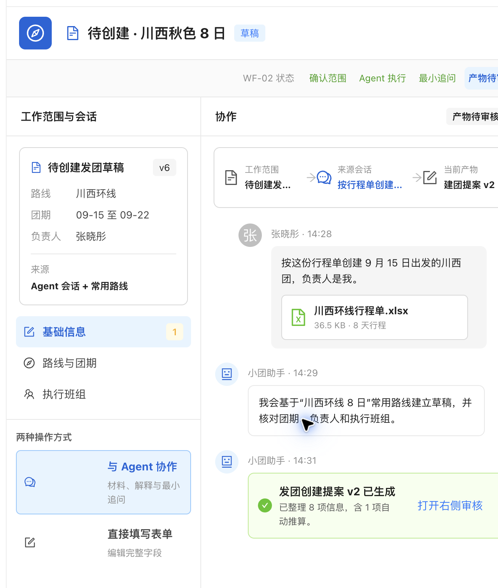

# WF-03「两种操作方式」入口审查

> 历史验证记录：本文及关联截图只证明当时版本，不能作为当前业务校验或验收规则。最新设计以 [#483](../../../prd/2026-09-07-business-object-agent-collaboration.md) 和 [本轮对齐记录](current-design-qa.md) 为准；年龄/电话类型强制核实、容量阻断、全局聊天及原收款简化已失效。

- Figma 标注板：<https://www.figma.com/design/3lAM9vTE12kTXAfzB6njxz>

## 结论

左栏不应保留“两种操作方式”。进入该页面后，User 已经处于 Agent 协作工作区，再次选择“与 Agent 协作”属于重复表态；与“直接填写表单”并列后，又会让同一草稿看起来像两套互斥工作模式。

## 当前流程

1. User 从原生新建页或 Agent 会话进入建团协作；
2. 页面左栏已经用草稿、业务分区和相关会话确定工作范围；
3. 中栏完成材料补充、解释和最小追问；
4. 右栏审核产物，并在需要时打开完整表单精确编辑；
5. 确认后创建正式发团。

## 建议

- 删除左栏“两种操作方式”整块；
- 原生页面继续保留“AI 辅助”作为进入协作工作区的入口；
- Agent 会话生成建团草稿后，用“打开创建工作区”进入此页面；
- 工作区内只在右侧审核区提供“编辑全部字段”，没有产物时可显示“打开完整表单”；
- 原生表单和 Agent 共用同一个 `taskId` / 草稿，但不把技术上的双入口暴露成页面一级导航。

## 实施状态

- 已从原型左栏删除“两种操作方式”；
- 已验证右侧“编辑全部字段 → 保存并返回审核”仍可正常使用。

## 可访问性边界

截图可确认层级和重复入口问题；键盘顺序、焦点返回和抽屉读屏提示仍需在实现阶段验证。
