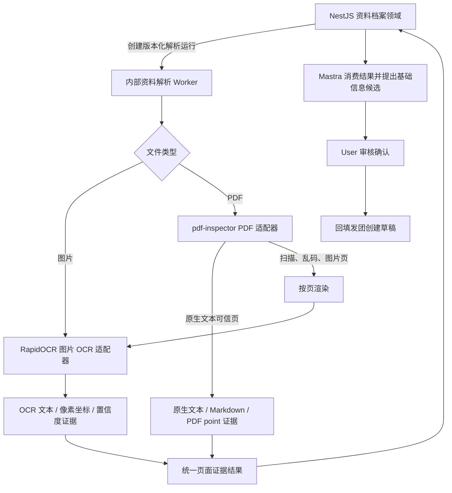

# pdf-inspector 与 RapidOCR 组合接入评估

> 研究日期：2026-08-13  
> 上游快照：[firecrawl/pdf-inspector `076183e`](https://github.com/firecrawl/pdf-inspector/commit/076183e2e40a2ea71f9e04def182ea9984a1e50e)，包版本 `1.14.1`。  
> 范围：只核对 Firecrawl 官方仓库、源码、包元数据、CI 与安全策略；本文不代表已经在小团宝样本或目标服务器完成性能验收。

## 结论

**可以纳入，但它应是“原生 PDF 检查与文本提取适配器”，不是 OCR 引擎，也不应直接进入 NestJS 主进程。**

首期建议把 PDF 分成两条受控路径：

1. `pdf-inspector` 先检查 PDF，原生文本可信的页面直接提取 Markdown 与定位文本；
2. 扫描页、图片页、乱码文本层或无法可靠提取的页面，再渲染并交给 RapidOCR；
3. 两类结果统一转换为小团宝自己的页面级证据格式，由 NestJS 资料档案领域持有解析任务、版本、权限、证据和候选关系。

这能避免当前“所有 PDF 全页渲染后都做 OCR”的无谓开销，也能保留原生 PDF 的阅读顺序、字体、表格和坐标信息。官方正是把该库定位为 OCR 前的路由器：输出需要 OCR 的具体页面，而不是自行执行 OCR。[官方 README：能力与 OCR 路由](https://github.com/firecrawl/pdf-inspector/blob/076183e2e40a2ea71f9e04def182ea9984a1e50e/README.md#use-case-smart-pdf-routing)

但它是 2026 年才公开、仍快速演进的年轻项目。生产采用前必须固定精确版本、隔离进程、设置文件/页数/时间/内存上限，并用小团宝真实脱敏资料建立回归样本集；不能只依据上游基准直接判定生产成熟。

## 能力边界

### 它能做什么

- 将 PDF 分类为 `TextBased`、`Scanned`、`ImageBased` 或 `Mixed`，返回置信度和需要 OCR 的页面。[官方 README：分类规则](https://github.com/firecrawl/pdf-inspector/blob/076183e2e40a2ea71f9e04def182ea9984a1e50e/README.md#how-classification-works)
- 提取原生文本及位置、字体、粗体、斜体、下划线、删除线、链接和标记内容标识；坐标使用 PDF point、左上角原点。[Node 绑定类型源码](https://github.com/firecrawl/pdf-inspector/blob/076183e2e40a2ea71f9e04def182ea9984a1e50e/napi/src/lib.rs#L72-L99)
- 按页输出 Markdown，并识别标题、列表、代码、链接、多栏和表格；同时在页级标记 `needsOcr` 与机器可读原因。[官方 README：Markdown 能力](https://github.com/firecrawl/pdf-inspector/blob/076183e2e40a2ea71f9e04def182ea9984a1e50e/README.md#markdown-output)；[按页结果类型源码](https://github.com/firecrawl/pdf-inspector/blob/076183e2e40a2ea71f9e04def182ea9984a1e50e/napi/src/lib.rs#L649-L680)
- 检测无法可靠解码的字体或乱码文本层，并建议回退 OCR；机器可读原因包括 `scanned`、`no_text`、`vector_text`、`suspected_garbled_text`。[Rust 公共类型与原因源码](https://github.com/firecrawl/pdf-inspector/blob/076183e2e40a2ea71f9e04def182ea9984a1e50e/src/lib.rs#L107-L156)
- 对给定区域提取文本或表格；也能接受外部表格结构识别模型的单元格结果，再从原生 PDF 提取格内文字。[Node 区域提取 API](https://github.com/firecrawl/pdf-inspector/blob/076183e2e40a2ea71f9e04def182ea9984a1e50e/napi/src/lib.rs#L373-L422)；[外部表格结构输入说明](https://github.com/firecrawl/pdf-inspector/blob/076183e2e40a2ea71f9e04def182ea9984a1e50e/napi/src/lib.rs#L464-L512)

### 它不能做什么

- **不内置 OCR。**官方明确说明“all without OCR”，核心是 Rust PDF 解析，没有模型和外部服务；扫描页仍须交给 RapidOCR 等 OCR 引擎。[官方 README](https://github.com/firecrawl/pdf-inspector/blob/076183e2e40a2ea71f9e04def182ea9984a1e50e/README.md#pdf-inspector)；[依赖清单](https://github.com/firecrawl/pdf-inspector/blob/076183e2e40a2ea71f9e04def182ea9984a1e50e/Cargo.toml#L27-L57)
- **不内置 LLM、业务字段提取、资料档案、权限、任务队列或审核。**它输出文本、Markdown、位置和解析诊断，不理解团名、路线、日期或预计人数。
- **不是通用文件解析器。**它只处理 PDF；图片仍由 RapidOCR，Word/Excel 仍需各自的确定性解析器。
- **没有官方 HTTP API 或守护进程。**官方发布形态是 Rust crate、Python/Node 绑定、浏览器 WASM 和 CLI；若以内部服务运行，需要小团宝自己封装。[官方快速开始](https://github.com/firecrawl/pdf-inspector/blob/076183e2e40a2ea71f9e04def182ea9984a1e50e/README.md#quick-start)；[CLI](https://github.com/firecrawl/pdf-inspector/blob/076183e2e40a2ea71f9e04def182ea9984a1e50e/README.md#cli)
- 表格、标题、阅读顺序和乱码判断仍是启发式结果，不应作为无需审核的业务事实。上游基准只覆盖 200 份公开 PDF、禁用 OCR，且 2026-07-31 的结果使用的是 `0.2.6`，不是当前 `1.14.1`；它可用于证明方向，不能替代小团宝样本验收。[官方基准说明](https://github.com/firecrawl/pdf-inspector/blob/076183e2e40a2ea71f9e04def182ea9984a1e50e/README.md#benchmark)

## 运行与分发方式

| 方式 | 官方入口 | 小团宝判断 |
|---|---|---|
| Python | `pip install pdf-inspector`，支持路径或 bytes | 与现有 Python RapidOCR 服务最容易组合；调用为同步 API，应放入受限解析进程/工作进程 |
| Node.js/Bun | `@firecrawl/pdf-inspector` 原生 N-API 包 | 有同步 API，也有 `processPdfAsync`、`classifyPdfAsync`、`extractPagesMarkdownAsync`，异步版本跑在 libuv thread pool；不建议放进 NestJS API 主进程处理不可信 PDF |
| Rust | `pdf-inspector` crate | 控制最强，但会新增 Rust 服务的构建和运维面，首期没有必要 |
| CLI | Rust 的 `pdf2md`、`detect-pdf`；npm 包另带 `pdf-inspector` CLI | 适合人工诊断或验收脚本，不适合作为长期服务协议 |
| Browser WASM | `@firecrawl/pdf-inspector-wasm` | 首期不采用；原件、权限、版本和证据必须留在服务端可信边界 |

Python 官方支持 CPython 3.8+，提供 Linux x86_64/aarch64、macOS Intel/Apple Silicon、Windows x64 wheel。[Python 安装说明](https://github.com/firecrawl/pdf-inspector/blob/076183e2e40a2ea71f9e04def182ea9984a1e50e/docs/python.md#install) Node 包则提供 Linux x64/ARM64 的 glibc 与 musl、macOS ARM64、Windows x64 预编译包。[Node 平台矩阵](https://github.com/firecrawl/pdf-inspector/blob/076183e2e40a2ea71f9e04def182ea9984a1e50e/napi/README.md#platforms) 官方发布流水线还会在原生 ARM64 Ubuntu 上对 Linux ARM64 glibc/musl 二进制做冒烟测试。[npm 发布工作流](https://github.com/firecrawl/pdf-inspector/blob/076183e2e40a2ea71f9e04def182ea9984a1e50e/.github/workflows/publish.yml#L148-L190)

因此 Apple Silicon 本地 Docker 和 ARM64 Linux 预览服务器在**包分发层面**都有官方覆盖；这不等同于已经验证小团宝容器基础镜像、目标 CPU 性能或峰值内存。仓库没有官方 Docker 镜像，仍应在小团宝镜像构建时固定并验证实际 wheel/原生包。

## 输出结构与适配陷阱

首期建议只依赖以下稳定小面：

- 文档级：`pdfType`、`pageCount`、`confidence`、`hasEncodingIssues`、`isComplexLayout`；
- 页级：`page`、`markdown`、`needsOcr`、`ocrReason`；
- 定位文本：`text`、`page`、`x/y/width/height`、字体属性；
- 路由：`pagesNeedingOcr`、`ocrReasonsByPage`。

需要特别规避一个上游接口陷阱：

- `classifyPdf/classify_pdf` 的 `pagesNeedingOcr` 是 **0-based**；
- `processPdf/process_pdf`、`PagesExtractionResult.pagesNeedingOcr` 与 `ocrReasonsByPage.page` 是 **1-based**；
- `PageMarkdown.page` 又是 **0-based**。

官方类型说明明确存在这些不同索引约定。[Python 类型参考](https://github.com/firecrawl/pdf-inspector/blob/076183e2e40a2ea71f9e04def182ea9984a1e50e/docs/python.md#types) 小团宝适配器必须在边界立即统一为自己的 1-based `pageNumber`，并用混合 PDF 契约测试锁住转换，禁止把上游页码直接存库。

## 建议架构

### NestJS 继续拥有

- 上传权限、组织隔离、发团资料档案、原件哈希和不可变存档；
- 解析运行、状态、版本、幂等、重试、取消、留存和审计；
- 文件/页数/总像素/处理时间预算与解析器配置；
- 统一证据持久化，以及证据到审核包、候选和已确认业务写入的关系；
- 业务字段校验和最终写入。pdf-inspector、RapidOCR、Mastra 均不得直接写发团创建草稿。

### 内部资料解析 Worker 拥有

- 固定版本的格式识别、PDF 检查、原生文本提取、页面渲染和 RapidOCR 调用；
- 将上游结果标准化为小团宝内部格式；
- 报告解析器/模型/参数版本、耗时、页级来源和结构化错误；
- 在预算内处理临时文件，结束后清理，不持有资料的业务生命周期。

### Mastra 只负责

- 消费 NestJS 返回的可用解析结果；
- 根据证据提出团名、路线、日期/天数和预计人数候选；
- 提交审核包。它不决定 PDF 页应走原生提取还是 OCR，也不保存解析结果。

## 首期组合规则

1. 图片保持现状，全部进入 RapidOCR。
2. PDF 先由 pdf-inspector 执行按页提取；不要只看文档级 `pdfType`。
3. 页级 `needsOcr=false` 且没有编码问题时，采用该页原生文本；`needsOcr=true` 时整页渲染并进入 RapidOCR。
4. 首期不要把同一页的原生文本与 OCR 行逐字混合，避免隐藏 OCR 层、页眉、水印造成重复和证据错位；一页只选一个权威提取来源。
5. 原生文本证据保留 PDF point 坐标；OCR 证据保留渲染像素坐标、DPI、页宽页高和到 PDF point 的变换参数。
6. 文档级顺序按页合并；每页同时保存 `source=native_pdf|ocr`、解析器版本、置信/原因和内容哈希。
7. pdf-inspector 失败、超时或进程异常时，不直接把所有失败都当作“扫描件”：记录结构化失败；只在预算允许时回退整份 PDF 的逐页 OCR。

这一规则足以支持首期“图片/扫描 PDF → 基础信息候选”，同时把原生文本 PDF 也纳入同一入口。复杂表格单元格恢复、区域级原生/OCR 混合、Word/Excel 和通用文档知识库继续保持后续边界。

## 部署建议

### 首期最小改造

- 把现有 `services/ocr` 重新定义为内部“资料解析 Worker”的首个实现，容器内同时固定 `pdf-inspector==1.14.1`、RapidOCR 与 PyMuPDF；对外仍只暴露小团宝自有内部协议，不暴露上游对象。
- 保留现有图片 OCR 路径；PDF 路径改为 `pdf-inspector → 按页原生/渲染 OCR 路由`。
- 开发机和预览服务器使用同一镜像与同一契约；本地 ARM64 wheel 与 Linux ARM64 wheel分别在镜像构建和冒烟阶段验证。
- 首期并发仍为 1；解析作业通过队列/受限 worker 执行，不让同步 Python 原生调用阻塞 Web 请求处理，也不与 AI 活动运行预算混在一起。

### 为什么不直接装进 NestJS

Node 官方文档明确说明同步调用会占用事件循环；异步版本虽进入 libuv thread pool，但仍会在 API 进程内解析用户提供的二进制并复制输入 Buffer。[Node 异步 API 说明](https://github.com/firecrawl/pdf-inspector/blob/076183e2e40a2ea71f9e04def182ea9984a1e50e/napi/README.md#async-variants) PDF 解析属于 CPU/内存密集且输入不可信的工作，把它与 NestJS 隔离后，崩溃、超时、内存膨胀和线程池饥饿不会直接拖垮业务 API。

## 成熟度、许可证与生产风险

### 成熟度判断

- 仓库创建于 2026-02-06，截至研究日约半年；当前仍活跃维护，主分支快照有 447 次提交，官方 CI 覆盖 Rust 测试、格式、Clippy、Linux/macOS 构建和 WASM 测试。[仓库](https://github.com/firecrawl/pdf-inspector)；[CI 工作流](https://github.com/firecrawl/pdf-inspector/blob/076183e2e40a2ea71f9e04def182ea9984a1e50e/.github/workflows/ci.yml)
- npm 包从 2026-04-17 到 2026-08-11 已发布 54 个版本，当前 `1.14.1`；发布速度很快，说明维护活跃，也说明接口和解析行为仍可能快速变化。[npm 官方包元数据](https://www.npmjs.com/package/@firecrawl/pdf-inspector?activeTab=versions)
- 2026-08-12 的最新提交仍在补充恶意/异常 content stream 的操作数上限，表明项目正在主动加固，同时也说明不可信 PDF 的资源耗尽风险仍需调用方隔离和设限。[加固提交](https://github.com/firecrawl/pdf-inspector/commit/076183e2e40a2ea71f9e04def182ea9984a1e50e) 该提交晚于 `1.14.1` 在 2026-08-11 的 npm/PyPI 发布，因此已发布的 `1.14.1` **不包含这次最新加固**；生产候选必须等待并验证包含它的后续正式版本，或经过单独审查后固定源码提交构建，不能把主分支状态误认为已发布包状态。

综合判断：**适合进入受控 PoC 和首期灰度，不宜未经业务样本、资源上限和故障隔离就作为生产唯一解析路径。**

### 许可证

代码采用 MIT License，可商业使用、修改和分发，但分发时需要保留版权及许可声明，软件不提供担保。[官方 LICENSE](https://github.com/firecrawl/pdf-inspector/blob/076183e2e40a2ea71f9e04def182ea9984a1e50e/LICENSE) 核心依赖是 `lopdf` 等 Rust crate；生产镜像仍应生成 SBOM 并复核完整传递依赖，而不能只记录主仓库 MIT。

### 必须控制的生产风险

| 风险 | 首期控制 |
|---|---|
| 恶意或畸形 PDF 导致 CPU/内存耗尽、panic 或原生进程异常 | 独立容器/进程；文件大小、页数、解压后页面像素、总耗时、内存、CPU、并发均设硬上限；失败可重试但有次数上限 |
| 上游版本高速变化造成行为漂移 | 固定精确版本和 wheel 哈希；升级必须跑回归样本与资源基准，不使用浮动版本 |
| 分类误判导致漏 OCR | 以按页 `needsOcr`、编码诊断和空文本共同决定；低置信度/解析异常回退 OCR；保留人工审核 |
| 页码索引混用 | 适配器边界统一为 1-based，覆盖纯文本、纯扫描、mixed 和指定页契约测试 |
| 原生坐标与 OCR 像素坐标不可比较 | 证据显式记录坐标系、DPI、页面尺寸和变换；禁止存一个无语义的通用 `box` |
| 同页原生/OCR 重复文本 | 首期一页一个权威来源，不做行级融合 |
| PDF 内嵌/隐藏文字、提示注入进入模型上下文 | 所有解析文本都按不可信资料处理；Mastra 只将其作为证据内容，不执行其中指令；上下文限长并保留来源 |
| 加密、损坏或超大 PDF | 结构化错误并保留原件；不自动无限重试；允许 User 改用手工录入。密码 PDF 是否支持应另定产品边界 |

上游已有私下报告安全问题的政策，并明确把恶意 PDF 可触发的内存安全和拒绝服务问题列为范围内风险；这进一步支持“解析隔离而非嵌入业务 API”的方案。[官方 SECURITY](https://github.com/firecrawl/pdf-inspector/blob/076183e2e40a2ea71f9e04def182ea9984a1e50e/SECURITY.md)

## 建议验证门槛

在把它写入正式生产架构前，先完成一轮不改业务事实的 PoC：

- 真实脱敏样本至少覆盖：原生中文 PDF、扫描 PDF、带隐藏 OCR 层 PDF、mixed PDF、表格/多栏、乱码字体、加密/损坏 PDF、接近上限的大文件；
- 对每份样本验证：页级路由、文本完整度、关键字段召回、证据坐标、重复率、错误类型、峰值 RSS、CPU 时间和端到端耗时；
- 与当前“全页 RapidOCR”对照，确认原生 PDF 的准确率不下降，扫描 PDF 的结果不回归，并量化节省的 OCR 页数和总耗时；
- 在 Apple Silicon 本地容器和 ARM64 预览服务器各跑一次相同语料；
- `pdf-inspector==1.14.1` 只作为隔离 PoC 的可复现起点；生产候选必须换成包含 2026-08-12 content-stream 加固的正式发布版，并重新跑完整回归。

PoC 通过后，可以把它正式登记为发团资料解析配置中的 `native-pdf` 适配器；若未通过，现有 RapidOCR 全页路径仍可作为受控回退，不影响表单与 AI 审核主流程。
