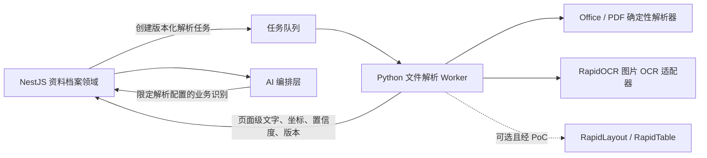

# RapidOCR 服务端文件解析能力评估

> 研究日期：2026-08-12  
> 研究目的：判断 RapidOCR 是否适合作为小团宝「发团资料解析」的自部署基础能力，并明确它与 NestJS、未来的 AI 编排层及 S3 `StoredObject` 的职责边界。  
> 研究边界：仅采用 RapidAI、PaddleOCR 的官方仓库、官方文档、发布记录和源码。本文中的架构、PoC 与选型判断属于结合当前仓库得出的推论，不构成法律意见。

## 1. 结论摘要

1. **RapidOCR 本体是 OCR 推理库，不是通用文件解析器。**它解决的是图片中的文本检测、方向分类、文字识别，返回文字、置信度及文本框；不原生理解 PDF 页、表格结构、版面、Office 文档或发团业务字段。[RapidOCR 官方简介](https://rapidai.github.io/RapidOCRDocs/main/)；[RapidOCR Python 主流程源码](https://github.com/RapidAI/RapidOCR/blob/main/python/rapidocr/main.py)
2. **可以采用，但应把名称和边界定为“自部署 OCR 引擎”。**它适合成为发团资料解析第一阶段中的一个适配器，不应独占“文件解析”职责，更不能直接生成业务候选。
3. PDF、版面、表格分别属于 RapidAI 的其他组件：`RapidOCRPDF`、`RapidLayout`、`RapidTable`。它们是独立包、独立版本和独立模型依赖，不是安装 RapidOCR 后自然获得的能力。[RapidOCRPDF](https://github.com/RapidAI/RapidOCRPDF)；[RapidLayout](https://github.com/RapidAI/RapidLayout)；[RapidTable](https://github.com/RapidAI/RapidTable)
4. 首期建议部署独立 Python OCR Worker/Service，默认使用 **ONNX Runtime CPU**，固定版本并在镜像构建时预下载模型；NestJS 持有资料、权限、解析任务和结果，Worker 只接受内部任务并返回页面级证据。RapidOCR 官方也优先推荐 ONNX Runtime CPU。[推理引擎官方文档](https://rapidai.github.io/RapidOCRDocs/main/install_usage/rapidocr/how_to_use_infer_engine/)
5. **ARM64 家庭服务器目前只能作为 PoC 假设，不能直接承诺生产可用。**官方 Docker 开发说明列出了不同后端镜像，却没有公布 ARM64 镜像矩阵、ARM64 性能或并发基准；实际还要验证 Python wheel、OpenCV、Shapely、ONNX Runtime、模型加载内存和持续负载。[官方 Docker 说明](https://github.com/RapidAI/RapidOCR/blob/main/docker/README.md)

## 2. RapidOCR 能做什么，不能做什么

### 2.1 本体能力

RapidOCR 官方将其定义为可离线部署、多平台、多语言的 OCR 工具；默认识别中英文，底层主要部署转换后的 PaddleOCR 模型。[官方简介](https://rapidai.github.io/RapidOCRDocs/main/) RapidOCR 3.x 的处理步骤是：

- 文本检测（Det）：在一张图中定位文字区域；
- 文本行方向分类（Cls）：默认处理 `0°/180°` 文本行方向；
- 文本识别（Rec）：把裁剪后的文字区域转成文本；
- 输出：文本框、识别文字、置信分数；可选文字/单字符坐标。[参数说明](https://rapidai.github.io/RapidOCRDocs/main/install_usage/rapidocr/parameters/)；[主流程源码](https://github.com/RapidAI/RapidOCR/blob/main/python/rapidocr/main.py)

当前 Python 源码接受 `str`、`Path`、图片字节、PIL Image 或 NumPy 数组；字符串路径和 URL 最终也由 PIL 按**图像**打开。因此“能传路径或 bytes”不等于支持任意文件格式。[图片加载源码](https://github.com/RapidAI/RapidOCR/blob/main/python/rapidocr/utils/load_image.py)

### 2.2 不是通用文件解析

RapidOCR 本体没有以下语义：

- PDF 页、加密 PDF、原生 PDF 文本层；
- 表格的行、列、合并单元格及 HTML/二维结构；
- 标题、正文、图片、表格等版面类别或阅读顺序；
- XLSX/XLS、DOCX/DOC、PPTX/PPT 的原生结构；
- “线路名称、出发日期、目的地”等发团业务字段。

上述边界也能从 RapidAI 的组件拆分得到直接印证：

| 能力 | 官方组件 | 官方定位 | 对小团宝的含义 |
|---|---|---|---|
| 图片文字 | [RapidOCR](https://github.com/RapidAI/RapidOCR) | 文本检测、分类、识别 | OCR 证据适配器 |
| PDF 文字 | [RapidOCRPDF](https://github.com/RapidAI/RapidOCRPDF) | 可复制 PDF 走 PyMuPDF，其他页面走 RapidOCR；输出页码、文本、置信度 | 可作为 PDF PoC 候选，但其输出较粗，仍需验证坐标证据和版本兼容 |
| 表格结构 | [RapidTable](https://github.com/RapidAI/RapidTable) | OCR + 表格结构模型，把表格图像还原为 HTML/逻辑坐标 | 独立的可选表格适配器，不属于基础 OCR |
| 文档版面 | [RapidLayout](https://github.com/RapidAI/RapidLayout) | 定位标题、段落、表格、图片等类别和位置；官方明确没有单一模型覆盖所有场景 | 独立的可选版面适配器，需要用业务样本选模型 |

Office 文件不应先渲染成图片再一律 OCR：XLSX/DOCX 的确定性原生结构应由专用库读取，只有嵌入图片、扫描页或无法直接读取的区域才进入 OCR。这也符合此前确定的“确定性解析优先，模型补充”方向。

## 3. 输入、语言、PDF、表格与版面能力

### 3.1 图片输入与输出粒度

- 可输入本地/网络图片路径、图片 bytes、PIL Image 和 NumPy 数组。[图片加载源码](https://github.com/RapidAI/RapidOCR/blob/main/python/rapidocr/utils/load_image.py)
- 图片格式实际受 PIL/OpenCV 解码能力约束，而不是 RapidOCR 提供的一份稳定业务 MIME 白名单；服务层仍应自己限制 MIME、字节数、像素数并验证真实文件头。
- 默认会把图片最长边缩放到 2000 px，检测模型也有自己的边长限制；小字、长截图和高分辨率表格可能因缩放丢失细节，需要在 PoC 中验证切片策略。[参数说明](https://rapidai.github.io/RapidOCRDocs/main/install_usage/rapidocr/parameters/)
- 可返回行级四点框、文本和识别分数；`return_word_box` 可返回更细坐标。小团宝应保留原始坐标系、页码/图片索引、模型与参数版本，不能只存拼接后的纯文本。[参数说明](https://rapidai.github.io/RapidOCRDocs/main/install_usage/rapidocr/parameters/)

### 3.2 语言

官方模型表显示：默认中英之外，还提供繁体中文、英文、日文、韩文、拉丁、阿拉伯、西里尔、梵文、泰文、希腊文等识别模型；但可用语种取决于 OCR 版本、识别模型大小和推理后端，不是一个模型自动覆盖全部语言。[官方模型列表](https://rapidai.github.io/RapidOCRDocs/latest/model_list/)

对发团资料而言，首期应固定一个主要模型组合（简中/英文），将繁中、日文及其他语种作为独立样本验证项；不要运行时凭文件内容自动下载和切换未知模型。

### 3.3 PDF、表格、版面和 Office

- **PDF**：RapidOCR 本体不读取 PDF。RapidOCRPDF 会先判断能否直接提取文本，可提取时使用 PyMuPDF，否则调用 RapidOCR；支持扫描、加密和可复制 PDF，并可选页处理。[RapidOCRPDF 官方仓库](https://github.com/RapidAI/RapidOCRPDF)
- **表格**：RapidTable 将 OCR 结果与表格结构模型组合，可输出 HTML/逻辑坐标；不同模型在后端、体积与速度上差异明显，例如官方列出的 Unitable 权重约 500MB，CPU 示例耗时约 6 秒。[RapidTable 官方仓库](https://github.com/RapidAI/RapidTable)
- **版面**：RapidLayout 只定位版面类别和位置，本身不等于阅读顺序恢复或业务字段理解；官方明确提示不同场景差异大，效果不佳时要自建训练集微调。[RapidLayout 官方仓库](https://github.com/RapidAI/RapidLayout)
- **Office**：上述四个组件都不是 Office 原生解析器。首期 XLSX 应使用确定性 Excel 解析器；DOCX 若开放，也应使用文档结构解析器，再对其中图片选择性 OCR。

## 4. Python 服务端部署

### 4.1 建议基线

建议先做如下固定基线：

- Python 独立容器；RapidOCR 使用固定发行版本，不跟随 `latest`；
- `pip install rapidocr onnxruntime`，CPU 先行；官方把 ONNX Runtime 作为默认后端并优先推荐 CPU 版。[安装指南](https://rapidai.github.io/RapidOCRDocs/main/install_usage/rapidocr/install/)；[推理引擎文档](https://rapidai.github.io/RapidOCRDocs/main/install_usage/rapidocr/how_to_use_infer_engine/)
- 镜像构建阶段预下载并校验模型，挂载只读/持久模型目录；避免首个用户任务触发联网下载。RapidOCR 3.8 起提供 `model_root_dir`，官方 Docker 说明也采用持久模型卷。[参数说明](https://rapidai.github.io/RapidOCRDocs/main/install_usage/rapidocr/parameters/)；[Docker 说明](https://github.com/RapidAI/RapidOCR/blob/main/docker/README.md)
- 容器禁止任意公网 URL 输入；只接受内部受权任务对应的受控字节/内部对象引用，以免形成 SSRF 和越权读取面。
- 进程设置 CPU/内存/任务超时/页面数/像素数限制；临时文件按任务隔离并清理。

RapidOCR Python 包声明支持 Python 3.8–3.13，核心依赖包括 OpenCV、NumPy、Shapely、Pillow、PyYAML、OmegaConf 等，推理引擎需另装。[Python 包配置](https://github.com/RapidAI/RapidOCR/blob/main/python/pyproject.toml)；[依赖清单](https://github.com/RapidAI/RapidOCR/blob/main/python/requirements.txt)

### 4.2 CPU、GPU 与 ARM64

- 官方当前优先推荐 ONNX Runtime CPU；文档不推荐 RapidOCR 的 ONNX Runtime GPU 路线，原因是 OCR 动态 shape 会带来缓存/传输成本。[推理引擎文档](https://rapidai.github.io/RapidOCRDocs/main/install_usage/rapidocr/how_to_use_infer_engine/)
- 需要 GPU 时还有 Paddle、PyTorch、TensorRT 等路径，但它们增加 CUDA、驱动、镜像和模型兼容矩阵；TensorRT 首次还要构建并缓存 engine。[Docker 说明](https://github.com/RapidAI/RapidOCR/blob/main/docker/README.md)
- 官方 Docker 页面是**开发/测试环境**说明，不是现成的生产 API 镜像承诺；也未提供 ARM64 性能和兼容矩阵。因此家庭 ARM64 服务器只能先跑 PoC，不能从“Python 跨平台”推导出依赖 wheel、吞吐和稳定性已经达标。

### 4.3 API 与并发

RapidAI 另有官方 [RapidOCRAPI](https://github.com/RapidAI/RapidOCRAPI)，用 FastAPI + Uvicorn 封装 `/ocr`，支持 `-workers`。但其 README 明确称它只是快速调用接口，**没有考虑多进程并发请求**；而且其版本表仍写 `rapidocr_api v0.2.x` 依赖 `rapidocr >1,<3`，不能直接当作 RapidOCR 3.x 的生产服务方案。[RapidOCRAPI README](https://github.com/RapidAI/RapidOCRAPI)

推荐自己做一个薄 Worker/Service，并把并发当作待测参数：

- 每个进程启动时加载一次固定模型；
- 外部并发先由任务队列限流，单 Worker 从并发 1 开始；
- 按内存与吞吐实测增加进程数，不在同一模型实例上先假定线程安全；
- 记录排队时间、单页耗时、各阶段耗时、峰值 RSS、超时和失败原因；
- GPU 只有在 CPU PoC 不达标并有足够量级时再评估。

## 5. 许可证

- RapidOCR 工程代码采用 Apache-2.0。[RapidOCR LICENSE](https://github.com/RapidAI/RapidOCR/blob/main/LICENSE)
- README 进一步声明：OCR 模型版权属于百度，其他工程脚本版权属于仓库所有者；项目整体以 Apache-2.0 发布。[RapidOCR README 许可证段](https://github.com/RapidAI/RapidOCR#%EF%B8%8F-license)
- PaddleOCR 官方仓库同样以 Apache-2.0 发布。[PaddleOCR 官方仓库](https://github.com/PaddlePaddle/PaddleOCR)
- RapidOCRPDF、RapidTable、RapidLayout 仓库目前均标示 Apache-2.0，但 RapidTable 的可选模型来自 PaddleOCR、PaddleX、Unitable/OhMyTable 等不同上游，采用任何非默认模型时仍应逐一保存模型来源、版本、哈希和许可证快照。[RapidTable 模型列表与来源](https://github.com/RapidAI/RapidTable)

**推论：**默认 RapidOCR/PaddleOCR 模型路线的许可信号较清晰，但生产发布前仍应生成软件及模型物料清单（SBOM/model BOM），保留 LICENSE/NOTICE，并对实际下载的每个模型文件单独复核；不能用 RapidOCR 主仓库许可证替代所有可选模型的审查。

## 6. 小团宝推荐架构边界

### NestJS / 资料档案领域拥有

- 上传权限、组织隔离、资料与 AI 建团任务/Departure 的关联；
- `StoredObject` 原件、解析任务状态、重试与幂等；
- 解析版本、解析器/模型/参数版本、页面证据与保留删除策略；
- 允许哪一种「发团资料解析配置」消费哪些基础结果；
- 最终候选、人工审核和业务写入。

当前 `FileStore` 是 S3 子集且由 API 持有凭证。推荐保持这一边界：NestJS 从 S3 取受权对象后，将受限字节交给 Worker，或者签发短时、单对象、只读内部 URL；**不要把组织级 S3 凭证交给 OCR 容器，也不要让 OCR 服务凭 object key 自主跨租户读取。**

### Python Worker 拥有

- MIME/文件头二次校验、图片解码、PDF 分页或 Office 确定性提取；
- 根据任务声明调用固定版本的 RapidOCR/其他适配器；
- 资源限制、临时文件、页级错误和可观测数据；
- 返回通用解析结果，不知道 `Departure`，不直接访问业务数据库，也不生成业务候选。

### AI 编排层拥有

- 消费已完成且版本化的基础解析结果；
- 按「发团资料解析配置」识别允许的业务字段；
- 将字段与具体页/框/单元格证据绑定，提出待审核候选；
- 不负责 OCR 进程生命周期，不直接修改正式业务数据。

当前仓库尚不存在 `apps/agent` 目录。因此以上是目标边界，不应误写成现有实现；AI 编排层落地时再用共享契约适配具体框架。

## 7. 风险与验证 PoC

### 7.1 主要风险

1. **能力误标**：把 OCR 宣传为“PDF/Excel/Word 全能解析”，导致产品承诺和证据粒度失真。
2. **ARM64 依赖风险**：关键 wheel 缺失、源码编译慢、容器架构或指令集不兼容。
3. **小字与长图损失**：默认缩放、截图压缩、表格密集文字造成漏检或错字。
4. **坐标与阅读顺序**：OCR 框排序不等于复杂版面阅读顺序；RapidOCRPDF 的页级纯文本输出未必满足候选证据定位。
5. **并发和内存**：多 Uvicorn Worker 会各自加载模型；盲目扩进程可能先耗尽家庭服务器内存。
6. **模型漂移**：首次运行自动下载或升级版本，会让同一原件重跑结果不可复现。
7. **文件安全**：解码器漏洞、压缩炸弹、超大像素、恶意 PDF、SSRF 和敏感资料临时文件泄露。
8. **语言与业务准确率**：OCR 高置信度不等于日期、人数、价格或地名在业务上正确。

### 7.2 建议 PoC 验收

在目标 ARM64 家庭服务器上，用脱敏的真实发团资料建立固定样本集，至少包含：

- JPG/PNG/WebP：清晰照片、手机截图、倾斜/旋转、弱光、长截图、小字；
- PDF：原生文本、扫描、图文混排、加密、10/50/100 页；
- 表格：有框/无框、合并单元格、中文与数字混排；
- 语言：简中+英文、繁中、至少一份日文；
- 负面文件：伪造 MIME、损坏图片、超大像素、超页数、无文字文件。

PoC 分三关：

| 关卡 | 验证内容 | 建议通过条件 |
|---|---|---|
| A. 可部署 | ARM64 镜像可重复构建；离线启动；模型哈希固定；健康检查成功 | 20 次冷/热启动无依赖和模型下载异常 |
| B. 质量 | 行级文字、日期/数字、框位置、页码；与人工金标比较 | 关键日期/人数/金额字符准确率单独统计；所有候选能定位证据，阈值由业务样本决定 |
| C. 容量 | 单并发与目标并发下的 P50/P95、峰值 RSS/CPU、超时、100 页任务恢复 | 资源不触发 OOM；任务可取消/重试；性能达到产品允许的后台等待时间 |

首个 PoC 只验证 **RapidOCR + ONNX Runtime CPU 的图片 OCR**；第二步再验证 PDF“原生文本优先、扫描页 OCR”；RapidTable/RapidLayout 只有在基础样本证明“表格/版面确实阻断业务字段识别”时才加入。这样能把 RapidOCR 是否适合目标服务器，与是否需要完整文档解析组件拆成两个可回答的问题。

## 8. 对当前讨论的建议决策

建议将正在讨论的解析职责补充为：

> RapidOCR 被采纳为首选的自部署 OCR 候选引擎，只负责图片或渲染页的文字检测与识别。PDF 原生文本、Office 结构、版面、表格及业务字段识别分别由独立适配器/解析配置负责；是否正式采用，以目标 ARM64 服务器和真实脱敏资料 PoC 通过为前提。NestJS 资料档案领域继续拥有原件、权限、解析任务、版本和证据，OCR Worker 不拥有业务资料，也不直接写业务数据。

这不会推翻已同意的职责分层，只是把“专用解析适配器”的首个实现候选明确为 RapidOCR，并避免把 RapidOCR 的 OCR 能力扩大解释成全文件解析平台。
